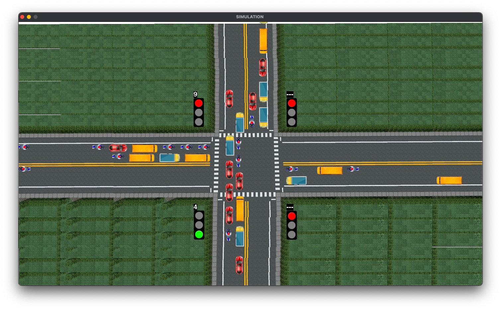

 
     

<h1 align="center">Advanced Traffic Intersection Simulation</h1>

    <h4>
        A Pygame-based simulation modeling vehicle movement and traffic light control at a 4-way intersection. 
        It features a timer system for traffic signals and supports various vehicle types such as cars, buses, 
        and trucks. The project can serve as a base for AI/ML traffic optimization or data analysis.
    </h4>

---

### Features

- Simulates a 4-way traffic intersection with dynamic traffic lights and timers.
- Vehicles generated include cars, trucks, buses, and bikes, with movement controlled by traffic rules and nearby vehicles.
- Suitable for visualization, data analysis, or integration with AI applications in traffic management.

---

